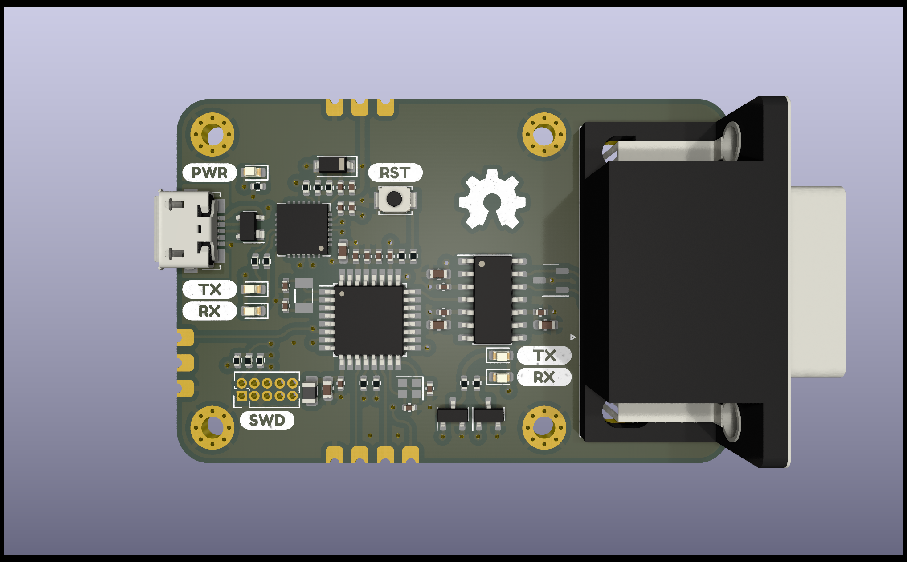

# sam-fd

ATSAMC21 based CAN-FD interface



## Initialization

Make sure you have a proper Zephyr development environment according to the official documentation.

```sh
west init -m https://git.leon.fyi/sam-fd-sdk --mr main sam-fd-workspace # or
west init -m https://github.com/leonrinkel/sam-fd-sdk --mr main sam-fd-workspace
cd sam-fd-workspace
west update
```

## Building

```sh
west build -b sam_fd sam-fd-sdk/app
```

## Flashing

```sh
west flash --runner jlink # or
west flash --runner pyocd
```

## License

Please see [hardware/LICENSE](hardware/LICENSE) and [sam-fd-sdk](https://git.leon.fyi/sam-fd-sdk). The software side of this project is based on [Zephyr](https://www.zephyrproject.org) which is mostly licensed under the [Apache-2.0](http://www.apache.org/licenses/LICENSE-2.0) license.
